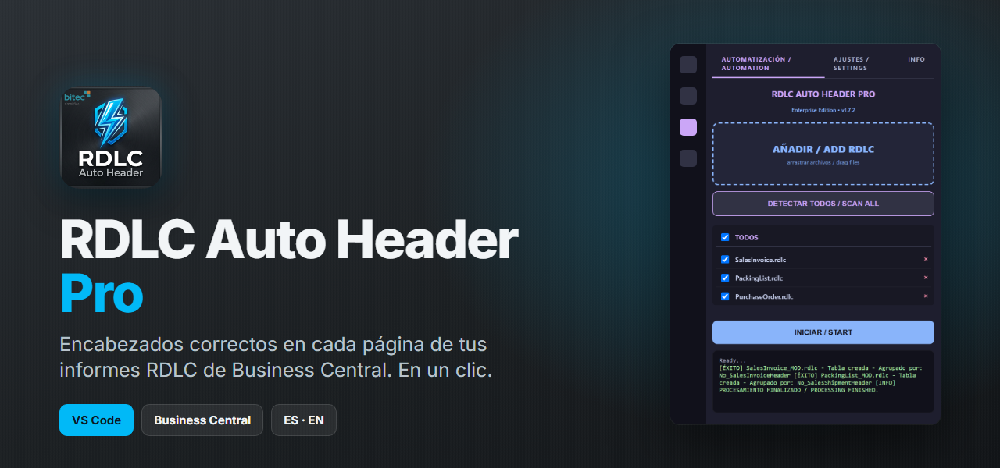
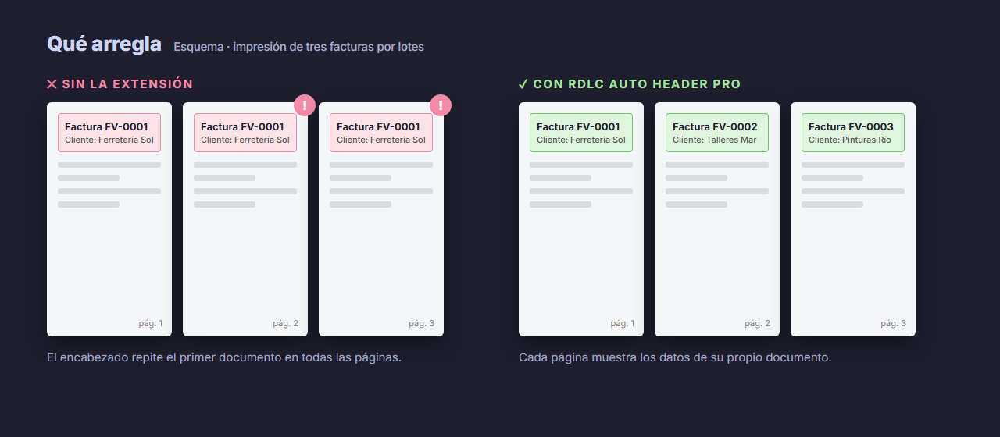
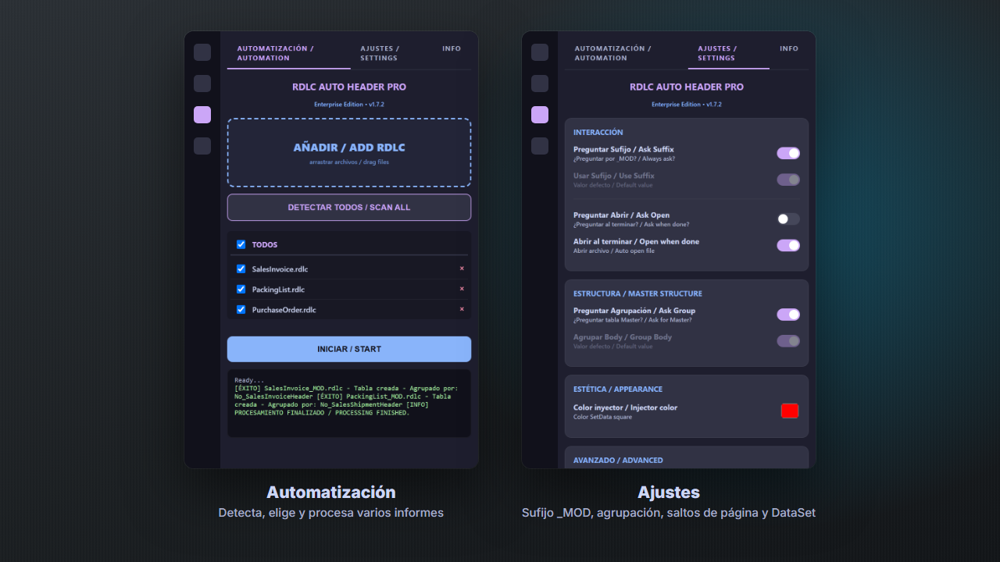

<p align="center">
  
</p>

<p align="center">
  <a href="https://marketplace.visualstudio.com/items?itemName=b3325c32-f6ee-4fad-9894-9af09cca5946.rdlc-autoheader"></a>
  <a href="https://marketplace.visualstudio.com/items?itemName=b3325c32-f6ee-4fad-9894-9af09cca5946.rdlc-autoheader"></a>
  <a href="https://marketplace.visualstudio.com/items?itemName=b3325c32-f6ee-4fad-9894-9af09cca5946.rdlc-autoheader&ssr=false#review-details"></a>
</p>

**RDLC Auto Header Pro** es una extensión de VS Code para quienes desarrollan informes RDLC en **Microsoft Dynamics 365 Business Central**.

Cuando imprimes varias facturas de una vez, el encabezado de los informes RDLC se queda con los datos del primer documento y los repite en todas las páginas. Arreglarlo a mano supone aplicar el patrón **SetData / GetData**: copiar expresiones, añadir código y crear un Tablix invisible. La extensión lo hace por ti en un clic.

<p align="center">
  
</p>

## Cómo funciona

1. **Añade el código** que guarda los datos de cada documento en el informe.
2. **Cambia las expresiones del encabezado** de `Fields!Campo.Value` a `Code.GetData(…)`.
3. **Crea un Tablix de control invisible** en el cuerpo, que llama a `Code.SetData` cada vez que cambia el documento.

El resultado se guarda como una copia con el sufijo `_MOD`, así que el informe original no se toca.

<p align="center">
  
</p>

## Qué puedes hacer

| | |
|---|---|
| ⚡ **Un informe o todos** | Clic derecho en un `.rdlc` o *Detectar todos* para procesar el proyecto entero. |
| 🧹 **Limpia expresiones** | Quita funciones sobrantes como `First()`. |
| 📄 **Saltos de página** | Elige dónde va el salto: al principio, al final o entre documentos. |
| 🗂️ **Varios DataSets** | Indica cuál es el principal en informes complejos. |
| 🛡️ **Sin riesgo** | Trabaja sobre una copia `_MOD`. |
| 🌍 **Español e inglés** | Toda la interfaz es bilingüe. |

## Instalar

Búscala como **RDLC Auto Header Pro** en la pestaña de extensiones de VS Code o instálala desde el [Marketplace](https://marketplace.visualstudio.com/items?itemName=b3325c32-f6ee-4fad-9894-9af09cca5946.rdlc-autoheader).

Después, abre su icono en la barra lateral, añade tus informes y pulsa **Iniciar**.

<details>
<summary><b>In English</b></summary>

<br>

**RDLC Auto Header Pro** is a VS Code extension for Microsoft Dynamics 365 Business Central developers. When you batch-print documents, RDLC report headers keep showing the first document on every page. The extension applies the **SetData / GetData** pattern in one click: it injects the VB.NET code, rewrites the header expressions and adds a hidden control Tablix. It saves the result as a `_MOD` copy and has a bilingual interface. [Get it on the Marketplace](https://marketplace.visualstudio.com/items?itemName=b3325c32-f6ee-4fad-9894-9af09cca5946.rdlc-autoheader).

</details>

<details>
<summary><b>Para desarrollar</b></summary>

<br>

El código de la extensión está en [`RDLCAutoHeader/`](RDLCAutoHeader/):

```bash
cd RDLCAutoHeader
npm install
npm run compile
```

Abre la carpeta en VS Code y pulsa `F5` para probarla en una ventana nueva.

</details>

## Créditos

Hecha por **[Álvaro Robles](https://github.com/roblesgg)** ([LinkedIn](https://www.linkedin.com/in/alvaro-robles-gonzález-bbb017240/)) con **bitec**.
Gracias a **[Junpeng Jin](https://www.linkedin.com/in/junpeng-jin-9587832b4/)** por el testing y su feedback.

<sub>Microsoft Dynamics 365 Business Central es una marca de Microsoft. Esta extensión no está afiliada con Microsoft. Las capturas son de la interfaz real con informes de ejemplo; el esquema de facturas es ilustrativo.</sub>
